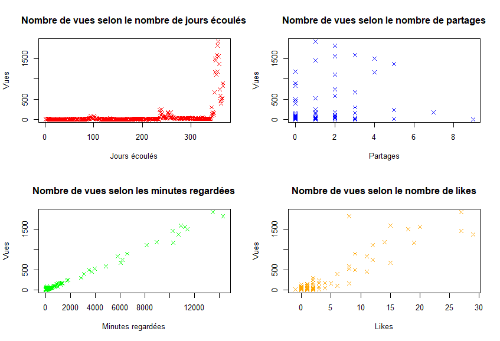
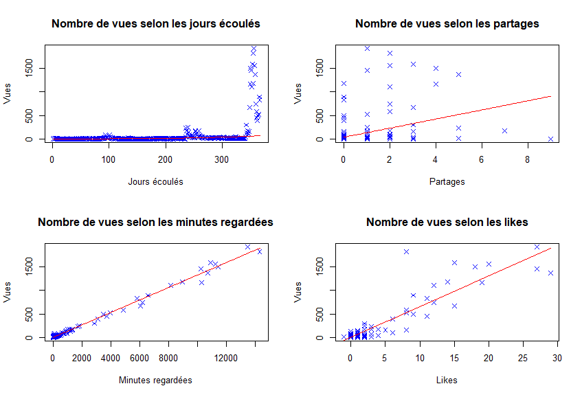

```{r setup, include=FALSE, eval=FALSE}
knitr::opts_chunk$set(echo=TRUE)
```

## Introduction du projet et des données

Ce projet s'inscrit dans le cadre de l'UE STAT1401 "Modèles linéaires et analyse de la variance" de l'Université Bretagne Sud.
Il consiste à sélectionner un jeu de données, essayer d'en tirer des modèles linéaires pertinents et à les critiquer.

Pour ma part, j'ai choisi de m'attaquer aux données d'une de mes chaînes Youtube : Evian. 
D'une part car j'étais curieux de voir ce que je pourrais en tirer, d'un point de vue stratégique et intellectuel, et d'autre part pour apprendre à extraire des données brutes puis à les traiter pour pouvoir les utiliser.

### Méthode d'extraction des données
Pour extraire les données de ma chaîne Youtube, j'ai dû utiliser l'API Youtube Analytics. 
J'ai donc eu à exécuter un script Python sur mon ordinateur pour récupérer mes données dans un ficher JSON :
```
# -*- coding: utf-8 -*-

import os
import google.oauth2.credentials
import google_auth_oauthlib.flow
from googleapiclient.discovery import build
from googleapiclient.errors import HttpError
from google_auth_oauthlib.flow import InstalledAppFlow

SCOPES = ['https://www.googleapis.com/auth/youtube']

API_SERVICE_NAME = 'youtubeAnalytics'
API_VERSION = 'v2'
#pour des raisons de sécurité, ce code secret est censuré. Le script ne marchera donc pas.
CLIENT_SECRETS_FILE = 'code_secret_client_CENSORED-q9a8cohev91q75c8qskfmqmibojae7ah.apps.googleusercontent.com.json' 
RESULTS = open("myBestVideoData.json", "w")
TEST = ''
def get_service():
  flow = InstalledAppFlow.from_client_secrets_file(CLIENT_SECRETS_FILE, SCOPES)
  credentials = flow.run_console()
  return build(API_SERVICE_NAME, API_VERSION, credentials = credentials)

def execute_api_request(client_library_function, **kwargs):
  response = client_library_function(
    **kwargs
  ).execute()

  print(type(response))
  print(response)
  RESULTS.write(str(response))
  RESULTS.close()

if __name__ == '__main__':
  # Disable OAuthlib's HTTPs verification when running locally.
  # *DO NOT* leave this option enabled when running in production.
  os.environ['OAUTHLIB_INSECURE_TRANSPORT'] = '1'

  youtubeAnalytics = get_service()
  TEST = execute_api_request(
      youtubeAnalytics.reports().query,
      ids='channel==MINE',
      startDate='2018-05-13',
      endDate='2019-05-13',
      dimensions='day',
      metrics = 'views,estimatedMinutesWatched,likes,dislikes,subscribersGained,comments,shares,
      annotationClickThroughRate,annotationClickableImpressions,averageViewDuration,
      averageViewPercentage',
      sort='day'

  )
```
Ensuite, on installe le package rjson pour lire les fichiers JSON :
```{r eval=FALSE}
install.packages("rjson")
library("rjson")
```
Et on les extrait :
```{r eval=FALSE}
json_file<-"data.json"
donneesBrutes <- fromJSON(paste(readLines(json_file), collapse=""))
donneesExtraites<-donneesBrutes[["rows"]]
```
Remarque : la structure du fichier JSON étant très particulière, j'ai dû légèrement user d'ingéniosité pour récupérer les données mais je vais épargner au lecteur ce problème algorithmique, car ce n'est pas l'objet de ce document.
Cela expliquera surtout certains codes de la suite qui sembleront peu usuels. Le lecteur intéressé pourra regarder et exécuter le script .R fourni avec le document pour vérifier qu'il fonctionne parfaitement.

### Choix des variables
Concrètement j'ai choisi d'étudier cinq variables de ma chaîne :
  
  + **views** : le nombre quotidien de vues de la chaîne 
  + **days** : le nombre de jours écoulés depuis le 13 mai 2018
  + **shares** : le nombre quotidien e partages de vidéos de la chaîne
  + **estimatedMinutesWatched** : le nombre quotidiens de "minutes regardées" sur la chaîne 
  + **likes** : le nombre de "likes" ou "j'aime" reçus quotidiennement sur la chaîne.

Ces variables sont évaluées chaque jour et j'ai choisi de les mesurer sur la dernière année écoulée depuis le jour où j'ai commencé ce projet. Donc du 13 mai 2018 au 13 mai 2019.

Note d'importance : je me suis rendu compte lors de la rédaction de ce rapport que nous sommes en 2020 et que donc les données ont un an de retard... Ce n'est pas très préjudiciable par la suite, mais mérite d'être souligné.

Je vais alors tenter d'expliquer le nombre de vues quotidiens **views** à l'aide des quatre autres variables. Pourquoi ?
  
  - Le nombre de vues est probablement l'une des données les plus importantes pour un vidéaste Youtube car elle détermine directement son chiffre d'affaire.
  - Concernant le choix des variables explicatives :
      - le nombre de jours écoulés **days** : il serait intéressant de voir après combien de temps on commence à "percer" ou à vraiment réussir sur Youtube, et comment cela évolue avec le temps.
      - le nombre de partages **shares** : plus les vidéos sont partagées, plus je devrais avoir de vues, non ?
      - le nombre de minutes regardées **estimatedMinutesWatched** : certains prétendent que la durée des vidéos influencent sur le nombre de vues (rétention de l'utilisateur), je veux vérifier ça.
      - le nombre de likes **likes** : certains prétendent que le nombre de likes influent sur le nombre de vues, je veux donc mettre ça à l'épreuve.
   
Je vais tout d'abord tenter plusieurs régressions linéaires simples et ensuite une regression multiple, selon les résultats des régressions simples.

\newpage

# Partie I : Régressions simples

Pour simplifier les notations, commençons par affecter chacune des variables explicatives à un vecteur Xi (i allant de 1 à 4) :
```{r eval=FALSE}

#Variable à expliquer : le nombre de vues par jour
Y<-unlist(DonneesChaineYoutube$views)

#Variables explicatives
X1<-unlist(DonneesChaineYoutube$day)#Jours écoulés
X2<-unlist(DonneesChaineYoutube$shares)#Partages par jour
X3<-unlist(DonneesChaineYoutube$estimatedMinutesWatched)#Minutes regardées par jour
X4<-unlist(DonneesChaineYoutube$likes)#Nombre de likes par jour
```
Par la suite, je parlerai respectivement de **vues**, **jours écoulés**, **partages**, **minutes regardées** et **likes** ou appelerai les variables par leur nom dans le code R.

# Premières visualisations graphiques

```{r, firstGraphs, echo=FALSE, fig.cap='Premiers graphiques',out.width='6in', fig.align='center', fig.pos='htbp'}

```
Quatre graphiques, quatre premières conjectures :

+ Les **vues** semblent varier exponentiellement selon les **jours écoulés**
+ Les **vues** ne semblent pas reliées linéairement aux **partages**
+ Les **vues** semblent très liées linéairement aux **minutes regardées**
+ Les **vues** semblent plutôt liées linéairement aux **likes**

Avant d'aller plus loin, rappelons la forme d'une relation linéaire : Y = B0 + B1.Xi.
Et rappelons que l'on peut linéariser un modèle exponentiel du type Y =  B0 * e^(B1.Xi) en une relation linéaire. 
On a alors : ln Y = lnB0 + B1.Xi.
Etudions donc nos conjectures.

# Calcul des régressions
## Calcul des coefficients de régression Bi

Commençons par expliquer les **vues** Y par les **jours écoulés** X1. On a alors ln Y = lnB0 + B1.X1.

Note importante : comme on pouvait (un peu) s'en douter sur la représentation graphique précédente, certaines valeurs de Y sont nulles. Or ln 0 est indéfini ! Il faut donc retirer les couples (Yi, Xi) où Yi = 0 de notre modélisation. 

C'est plus ou moins ce que j'ai fait avec la fonction deleteNaNValues (R considère que ln 0 = -Inf, j'ai donc retiré les valeurs nulles et infinies à posteriori), ce qui a demandé une certaine dextérité algorithmique que je vais encore une fois épargner au lecteur.
```{r echo=FALSE, eval=FALSE}
deleteNaNvalues<-function(y,x1)
{
  newY<-vector(mode="numeric")
  newX1<-vector(mode="numeric")
  indexesToDelete<-sort(c(which(y %in% -Inf), which(y %in% Inf),which(y %in% -0)))
  newY<-y[-indexesToDelete]
  newX1<-x1[-indexesToDelete]
  
  return(list(newX1,newY))
}
```
```{r eval=FALSE}
#Premier modèle : linearisation d'une relation expontielle Y = B0.e^(B1X1) en un modèle ln Y = ln B0 + B1X1
lnY<-log(Y)
X1<-deleteNaNvalues(lnY,X1)[[1]]
lnY<-deleteNaNvalues(lnY,X1)[[2]]

varX1<-var(X1)#variance de X1
CX1Y<-cov(lnY,X1) #covariance de X1 et du logarithme de Y

#Calcul des estimateurs de façon manuelle
B1estime1<-CX1Y/var(X1)
#>0.00901808
lnB0estime1<-mean(lnY)-B1estime1*mean(X1)
#>0.96878777
B0estime1<-exp(lnB0estime1)
#>2.63474861
```
Utilisons maintenant la fonction lm() de R pour récupérer les coefficients des autres régressions :
```{r eval=FALSE}
#Regression 2 : Vues selon les partages quotidiens
regressionYX2<-lm(Y~X2)
B0estime2<-regressionYX2$coefficients[1]
#>38.8
B1estime2<-regressionYX2$coefficients[2]
#>96.6

#Regression 3 : Vues selon le nombre de minutes regardées quotidiennement

regressionYX3<-lm(Y~X3)
B0estime3<-regressionYX3$coefficients[1]
#>4.58
B1estime3<-regressionYX3$coefficients[2]
#>0.132


#Regression 4 : Vues selon le nombre de likes quotidiens

regressionYX4<-lm(Y~X4)
B0estime4<-regressionYX4$coefficients[1]
#>5.04
B1estime4<-regressionYX4$coefficients[2]
#>65.2
```
Nous pouvons désormais estimer Y pour nos quatre modèles à l'aide de nos coefficients :
```{r eval=FALSE}
lnYestime1<-lnB0estime1+B1estime1*X1#Estimation de ln Y
Yestime1<-exp(lnYestime1)#puis de Y
Yestime2<-B0estime2+B1estime2*X2
Yestime3<-B0estime3+B1estime3*X3
Yestime4<-B0estime4+B4estime4*X4
```
### Visualisations graphiques de nos modèles et suite des conjectures
```{r, newGraphs, echo=FALSE, fig.cap='Graphiques et droites de regression',out.width='6in', fig.align='center', fig.pos='htbp'}

```
Modèle par modèle :

* notre modèle exponentiel des **vues** selon les **jours écoulés** ne semble pas fonctionner. A tel point que j'ai cru tout d'abord avoir fait des erreurs de calcul ou dans la modélisation, mais ils sont corrects. Le B1 estimé étant quasiment nul (et il n'y a pas d'erreur dans ce calcul), ça semble logique.
* notre modèle des **vues** selon les **partages** ne semble pas bien fonctionner, mais mieux que je le pensais.
* notre modèle des **vues** selon les **minutes regardées** semble très bien fonctionner.
* notre modèle des **vues** selon les **likes** semble à peu près fonctionner.

Nous allons désormais calculer des indicateurs d'adaptation de nos modèles afin d'affiner, confirmer ou infirmer nos conjectures.

# Indicateurs d'adaptation des régressions
## Coefficients de corrélation
```{r eval=FALSE}
#Coefficients de correlation

#Regression 1
rho1X1Y<-cor(lnY,X1)
#>0.6532197

#Regression 2
rhoX2Y<-cor(Y,X2)
#>0.37886849

#Regression 3
rhoX3Y<-cor(Y,X3)
#>0.99629185

#Regression 4
rhoX4Y<-cor(Y,X4)
#>0.91838271
```
Commentaires :

* Les **vues** sont finalement bien corrélées aux **jours écoulés**. Mon interprétation est que notre modèle explique en effet très bien les 300 premières vues (sur 366) environ, si l'on se fit aux graphiques.
* Les **vues** sont peu corrélées aux **partages**. Peu de surprises.
* Les **vues** sont très bien corrélées aux **minutes regardées**, comme on pouvait s'y attendre.
* Les **vues** sont très bien corrélées aux **likes**, mieux que je ne le conjecturais.

## Résidus
### Calcul des résidus
```{r eval=FALSE}
#Regression 1
lnresidus1<-lnYestime1-lnY
residus1<-exp(lnresidus1)
r1<-summary(residus1);r1
#> Min.    1st Qu.  Median    Mean  3rd Qu.    Max. 
#> 0.03398 0.57127 1.21619 1.58785 2.09339 7.24569

#Regression 2
residu2<-Y-Yestime2
r2<-summary(residus2);r2
#> Min.    1st Qu.  Median    Mean  3rd Qu.    Max. 
#>-903.36  -35.85  -31.85    0.00  -18.85 1786.54 

#Regression 3
residus3<-Y-Yestime3
r3<-summary(residus3);r3
#> Min.    1st Qu.  Median            Mean  3rd Qu.    Max. 
#>-201.7942   -3.3379   -0.8407    0.0000    2.3662  152.7435 

#Regression 4
residus4<-Y-Yestime4
r4<-summary(residus4);r4
#> Min.           1st Qu.  Median    Mean  3rd Qu.    Max. 
#> -522.1524   -3.0364    0.9636    0.0000   11.9636 1292.0006
```
### Calcul de la somme des carrés des résidus
```{r eval=FALSE}
sCres1<-sum(residus1^2)
#>1577.044062
sCres2<-sum(residus2^2)
#>20938710.612089
sCres3<-sum(residus3^2)
#>180977.181021
sCres4<-sum(residus4^2)
#>3827903.285261
```
### Commentaires
```{r eval=FALSE}
statistiquesY<-summary(Y);statistiquesY
#> Min.   1st Qu.  Median   Mean  3rd Qu. Max. 
#>0.00    5.00   10.00   75.27   24.75 1922.00
```
On remarque que 50% des valeurs de Y sont comprises entre 5 et 24.75 mais que la variable est très hétérogène, comme le montre les extremums et la différence de 65 points entre la médiane et la moyenne. Un bon modèle doit donc prendre en compte cet étalement des valeurs qui ne doit pas nous étonner, au contraire.
De ce fait :

* le modèle des **vues** selon les **jours écoulés** a très peu de résidus extrêmes... ce qui doit nous alarmer ici !
Ce modèle ne prédit pas les grandes variations de Y. Comme je l'ai fait remarquer, il prédit très bien les 300 premières vues... mais pas la fin de la série, lorsque les variations deviennent très importantes ! Cela confirme donc mon hypothèse.
* le modèle des **vues** selon les **partages** a des résidus extrêmes. Cependant 50% des résidus sont entre -35 et -18. Cela signifie d'une part qu'ils ne "s'équilibrent" pas (le modèle a tendance a prédire moins de **vues** que la réalité) et d'autre part qu'ils restent plutôt éloignés les uns des autres.
* le modèle des **vues** selon les **minutes regardées** a des résidus extrêmes et 50% d'entre eux se concentrent entre -3 et 2 autour de -0.8, ce qui est excellent je trouve.
* le modèle des **vues** selon les **likes** a des résidus extrêmes et 50% d'entre eux se concentrent entre -3 et 11 autour de 0.9, ce qui est bon aussi.

Les sommes des carrés des résidus sont difficilement interprétables vu l'hétérogénéité de Y donc je ne vais pas m'y risquer pour éviter tout biais de confirmation ou autre.

## Dispersion et coefficient de détermination
### Calcul des dispersions

```{r eval=FALSE}
#Dispersion observée de Y
sCtot<-sum((Y-mean(Y))^2)
#>24448010.677596

#Dispersion des régressions
sCreg1<-sum((Yestime1-mean(Y))^2)
#>1117177.529076
sCreg2<-sum((Yestime2-mean(Y))^2)
#>3509300.065506
sCreg3<-sum((Yestime3-mean(Y))^2)
#>24267033.496574
sCreg4<-sum((Yestime4-mean(Y))^2)
#>20620107.392334
```
### Calcul des coefficients de détermination
```{r eval=FALSE}
R2_1<-sCreg1/sCtot
#>0.045696
R2_2<-sCreg2/sCtot
#>0.143513
R2_3<-sCreg3/sCtot
#>0.992597
R2_4<-sCreg4/sCtot
#>0.843426
```
### Commentaires
En théorie, plus le coefficient de détermination R² est proche de 1, plus nos modèles sont adaptés. Ici nos conjectures ne font que se confirmer, je n'insiste donc pas plus.

# Tests de significativité
J'ai choisi de tester uniquement la 3ème régression, car comme nous l'avons vu il s'agit de notre meilleur modèle.

## Calculs préliminaires
```{r eval=FALSE}
#Récupération des données
X<-X3
n<-length(Y) #Nombre d'observations
B0<-B0estime3
B1<-B1estime3
Yestime<-Yestime4 #Y estimé à l'aide du modèle
R2<-R2_4 #Coefficient de détermination


#Calcul des variances
varY<-sum((Yestime-mean(Y))^2)/(n-2) #variance de Y
varX<-var(X)
varB1<-varY/(n*varX)
varB0<-varY/n*(1+mean(X)^2/varX)
```
## Test de significativité de B1
On veut tester H0 : B1 = 0 contre H1 : B1 $\neq$ 0 au seuil alpha = 0.01.

Si H0 est vraie, alors la statistique de test B1/$\sqrt{var(B1)}$ suit une loi de Student à n-2 degrés de liberté, d'où :
```{r eval=FALSE}
alpha<-1/100
T_B1<-B1/sqrt(varB1)
#>19.1

T_Theorique<-qt(alpha,n-2,lower.tail = FALSE)
#>2.336
```
|T_B1| > T_0.01, on rejette donc H0 avec une probabilité alpha égale à 1% de se tromper. Selon notre test, B1 n'est pas nul et donc les **minutes regardées** peuvent expliquer les **vues**.

## Test de significativité de B0
On veut tester H0 : B0 = 0 contre H1 : B0 $\neq$ 0 au seuil alpha = 0.01.

Si H0 est vraie alors la statistique de test alors la statistique de test B0/$\sqrt{var(B0)}$ suit une loi de Student à n-2 degrés de liberté, d'où : 
```{r eval=FALSE}
alpha<-1/100
T_B0<-B0/sqrt(varB0)
#>0.327

TTheorique<-qt(alpha,n-2,lower.tail = FALSE)
#>2.336
```
|T_B0| < T_0.01, on ne rejette donc pas H0 au seuil alpha = 0.01. Selon notre test, B0 n'est donc pas significatif dans notre modèle, il n'explique pas les **vues**.
Note : ceci est plutôt rassurant, car lorsqu'il y a 0 **minutes regardées**, il devrait y avoir 0 **vues** !

On a alors Y = 0.132 * X3. Une **vue** supplémentaire toutes les 0.132 **minutes regardées** !

# Conclusion de la première partie

Pour rappel, nous tentions d'expliquer les **vues** de ma chaîne Youtube à l'aide d'un modèle linéaire selon plusieurs variables :

* les **jours écoulés** : tout d'abord prometteur, il s'est avéré être un modèle médiocre pour expliquer la hausse soudaine des **vues** sur les derniers jours.
* les **partages** : rapidement écarté.
* les **minutes regardées** : notre modèle le plus précis.
* les **likes** : un modèle moins solide, mais correct.

### Premières interprétations

* je pensais que les **vues** augmenteraient exponentiellement avec les **jours écoulés**... mais je me trompais ! Il y a vraiment eu une hausse soudaine de mes vues sur les derniers jours, il a dû se passer quelque chose de particulier non explicable par ce modèle. 
En réalité, on peut observer des "pics" de **vues** tous les 100 **jours écoulés** environ, mais la dernière a été beaucoup plus grande et m'a donc induit en erreur. Nous donnerons une piste de réflexion à ce propos dans le paragraphe suivant.
* contrairement à ce qu'on pourrait croire, les **partages** des vidéos semblent un mauvais levier pour augmenter les **vues**, en tout cas comparé à d'autres que nous allons étudier.
* les **minutes regardées** semblent le meilleur moyen d'augmenter les **vues**... Mais attention à ne pas confondre corrélation et causalité ! Je ne serais pas étonné que ce soit en réalité un plus grand nombre de **vues** sur les vidéos qui causent plus de **minutes regardées**, ou bien une autre variable qui lie les deux que nous étudierons par la suite. Je constate que mon choix de cette variable n'était pas forcément pertinent.
* les **likes** semblent un bon levier pour augmenter les **vues**. Difficile cependant de savoir si c'est les **likes** qui augmentent les **vues** ou le contraire... sûrement un peu des deux comme nous allons le voir maintenant...

### Discussion à propos de l'algorithme de recommandation de vidéos de Youtube
De la culture populaire, en passant par les rumeurs urbaines de vidéastes Youtube pour finir par des sources scientifiques plus sérieuses, il semble y avoir un consensus sur le fait que l'algorithme Youtube est décisif pour un vidéaste afin que ce dernier réussisse sur cette plateforme. Dans mon cas et dans le cadre de ce rapport, cela semble en effet être le cas comme le montre la figure 3.

On peut voir notamment à droite que 83.5% de ce que Youtube appellent les impressions (c'est à dire le nombre de fois où un éventuel spectateur a eu une miniature de mes vidéos sur son écran) sont dûes à leur algorithme pour ma chaîne. 
On voit donc que l'algorithme fait en réalité la majorité de mes vues, par effet tunnel bien illustré sur cette page.

Cela explique plutôt bien nos modèles :

* les **jours écoulés** expliquent plutôt bien les **vues**... jusqu'au jour où Youtube décide de recommander de façon drastique une ou plusieurs de mes vidéos.
* les **partages** sont un faible levier pour expliquer les **vues** comparés aux impressions de l'algorithme Youtube.
* je suspecte ainsi que les impressions sont la variable de confusion majeure qui lie les **likes**, les **minutes regardées** et les **vues**.
 
Cependant je ne mettrais pas les **partages** et les **likes** comme moyen de levier pour augmenter les **vues** à la poubelle. On remarque par exemple sur la figure 3 que 18% des sources de traffic proviennent de sources externes.
Nous pourrions très bien suspecter que les **partages** soient un premier levier d'attraction des **vues** et qu'ensuite l'algorithme réagisse à ces derniers en recommandant les vidéos. De plus, selon Youtube même, les **likes** sont l'un des paramètres étudiés par l'algorithme pour décider ou non de recommander une vidéo.

Démêler et préciser tout ça nécessite grandes investigations et études supplémentaires, probablement avec plus d'outils que de simples modèles linéaires (j'aimerais voir des études contre groupes contrôles, par exemple... Cela existe peut être déjà d'ailleurs, mais cela sort légèrement du cadre de ce document).

```{r, youtubeAlgorithm, echo=FALSE, fig.cap='Sources de trafic de ma chaîne Youtube du 13 mai 2018 au 13 mai 2019 ',out.width='6in', fig.align='center', fig.pos='htbp'}

```

\newpage

# Partie 2 : Régression multiple

Dans cette partie nous allons procéder à une régression multiple des **vues** par rapport à toutes les autres variables explicatives, sauf les **jours écoulés** car nous avons vu d'une part que ce n'était pas un si bon indicateur que cela pour prédire les **vues** et d'autre part pour des raisons techniques que nous voulons nous épargner ainsi qu'au lecteur (liées à des logarithmes égaux à l'infini et des tailles de vecteurs différents...).

# Regression de Y sur X2, X3, X4

## Construction de la matrice de régression

```{r eval=FALSE}
n<-length(Y)
q<-1+3
ones<-rep(1,n)
X<-matrix(c(ones,X2,X3,X4),ncol=q);head(X)
```


```{r eval=FALSE}
#     [,1] [,2] [,3] [,4]
# [1,]    1    0    1    0
# [2,]    1    0    6    0
# [3,]    1    0    2    0
# [4,]    1    0    4    0
# [5,]    1    0    6    0
# [6,]    1    0    8    0

Y<-matrix(Y);head(Y)
#     [,1]
# [1,]    2
# [2,]    7
# [3,]    3
# [4,]    5
# [5,]    7
# [6,]    7

#Résolution de la régression
BestimeM<-solve(t(X)%*%X)%*%t(X)%*%Y;BestimeM
#            [,1]
# [1,]  5.4706727
# [2,] -4.4542989
# [3,]  0.1298974
# [4,]  1.8674736

YestimeM<-X%*%BestimeM
```
On obtient ainsi une première regression multiple : Y = 5.4706727 - 4.4542989.X2 + 0.1298974.X3 + 1.8674736.X4. Mais que vaut-elle ?

## Test de global de linéarité
On veut tester H0 : Bi = 0, i = {0,1,2,3} contre H1 : au moins l'un des Bi est non nul au seuil alpha = 0.01.
Sous H0, on construit une statistique de test suivant une loi de Fischer à q et n-q-1 degrés de liberté d'où :
```{r eval=FALSE}
alpha<-1/100
Fcalc<-(sum((YestimeM-mean(Y))^2)/q)/(sum((YestimeM-mean(Y))^2)/(n-q-1))
#>90.25
Ftheorique<-qf(alpha,df1 = q,df2 = n-q-1,lower.tail = FALSE)
#>3.371496
```
|Fcalc| > F_0.01, on rejette donc H0 avec une probabilité alpha égale à 1% de se tromper. Selon notre test, au moins l'un des Bi est non nul, notre regression explique donc bien Y.

## Tests de significativité des Bi
Pour tout i = {0,1,2,3}, on veut tester H0 : Bi = 0 contre H1 : Bi $\neq$ 0 au seuil alpha = 0.01.

Sous H0, on construit une statistique de test T suivant une loi de Student à n-q-1, d'où :
```{r eval=FALSE}
varY_M<-sum((YestimeM-mean(Y))^2/(n-q-1))#variance de Y
#>67243.4159639

varcov<-varY_M*solve((t(X)%*%X))#matrice variance-covariance
sigmaBi<-sqrt(diag(varcov))#ecart type estimateurs des Bi

#statistiques de test
Tcalc<-BestimeM/sigmaBi;Tcalc
#            [,1]
# [1,]  0.3742456
# [2,] -0.3033413
# [3,]  7.3722610
# [4,]  0.1963265
Ttheroique<-qt(alpha,df=n-q-1,lower.tail = FALSE)
#>2.33675
```
On rejette ainsi H0 uniquement pour B2 avec une probabilité alpha égale à 1% de se tromper. Selon notre test, seul B2 est significatif dans notre modèle.
On revient ainsi à une regression simple Y = 0.1298974.X3. Jugeons tout de même de la qualité de la régression multiple, cela devrait également nous éclairer sur ce résultat.

## Indicateurs d'adaptation de la modélisation
### Coefficient de corrélation entre les variables
```{r eval=FALSE}
variables<-data.frame(Y,X2,X3,X4)
corX2X3X4Y<-cor(variables);corX2X3X4Y
#            Y        X2        X3        X4
# Y  1.0000000 0.3788685 0.9962919 0.9183827
# X2 0.3788685 1.0000000 0.3937959 0.4108525
# X3 0.9962919 0.3937959 1.0000000 0.9185389
# X4 0.9183827 0.4108525 0.9185389 1.0000000
```
On retrouve les mêmes coefficients de regression entre les Xi et Y que dans la partie 1. De plus on remarque également que X3 et X4 sont très fortement corrélées, comme nous le soupçonnions dans la fin de la partie 1. 
X2 est également plutôt corrélée à X3 et X4.
On comprend ainsi pourquoi les autres variables ne sont pas significatifs dans notre modèle (X3 "suffit" à expliquer Y).

### Dispersion et coefficient de détermination
```{r eval=FALSE}
sCtot<-sum((Y-mean(Y))^2)#Dispersion observée de Y
sCregM<-sum((YestimeM-mean(Y))^2)#Dispersion restitué par le modèle

R2_M<-sCregM/sCtot#Coefficient de détermination
#>0.9929181
```
Le coefficient de détermination est très proche de 1, ce qui est logique vu qu'il s'agit finalement de notre 'meilleur' modèle linéaire trouvé dans la partie 1.

### Résidus
```{r eval=FALSE}
residusM<-c(Y-YestimeM)
summary(residusM)
#     Min.  1st Qu.   Median     Mean  3rd Qu.     Max. 
# -196.780   -3.857   -1.315    0.000    2.297  162.116 

#Somme des carrés des résidus
sCresM<-sum(residusM^2)
#>24274873.1629698

#rappel des statistiques du Y observées
summary(Y)
#> Min.   1st Qu.  Median   Mean  3rd Qu. Max. 
#>0.00    5.00   10.00   75.27   24.75 1922.00
```
L'analyse des résidus revient au même que dans la partie 1 et n'apporte rien de plus, nous allons donc arrêter ici.

# Conclusion de la seconde partie
Nous avons tenté d'expliquer les **vues** par une régression multiple et nous sommes rapidement aperçus que X2 et X4 n'étaient pas signiicatifs et que le modèle revenait à une régression linéaire simple comme trouvé dans la partie 1.
L'analyse des coefficients de corrélation entre les variables nous donne une explication : X2, X3 et X4 sont liées, comme nous le soupçonnions dans la partie 1.

On concluera donc en disant qu'il nous faut des variables plus pertinentes pour tenter une régression multiple.
\newpage

# Conclusion du projet
# Rappel de la problématique
Nous avons tenté d'expliquer les **vues** de ma chaîne Youtube à l'aide de variables qui nous semblaient pertinentes à priori, afin de les augmenter et donc faire grandir mon chiffre d'affaire.

# Résumé de la démarche

* **Comparaison de quatre modèles linéaires simples par quatre variables explicatives distinctes**

Lors de cette étape, nous avons conclu que les **jours écoulés** n'étaient pas un bon indicateur pour estimer le nombre de **vues**, contrairement aux **minutes regardées** et aux **likes**. Cependant suite à une discussion sur le fonctionnement de l'algorithme et surtout de son omniprésence pour expliquer les **vues**, nous n'avons pu déterminer de réels liens de causalité. Cela mérite investigation.

* **Evaluation d'un modèle linéaire multiple impliquant trois variables distinctes**

Dans cette partie, nous avons très rapidement conclu que seules les **minutes regardées** comptaient dans ce modèle. Notre hypothèse est qu'il s'agit finalement d'un très mauvais choix de variable explicative. Nous l'avons d'abord choisi pour évaluer le taux de rétention des utilisateurs sur la chaîne, mais une variable comme le pourcentage d'une vidéo regardée par jour aurait éete plus pertinent pour cela et disponible sur l'API Youtube. 
Nous y avons songé mais ayant rencontré des problèmes techniques, cela a été abandonné. Cela mérite donc de nouvelles études.

# Solutions et pistes d'amélioration
Nous avons mis à jour indirectement que les impressions générées par l'algorithme de Youtube semblent le meilleur moyen d'augmenter les **vues**. Nous suggérons ainsi plus d'études avec de meilleures variables explicatives incluant ces fameuses impressions à l'avenir (nous avons tenté de les récupérer par l'API pour ce projet, mais sans succès. Sont-elles disponibles ?). 

Nous avons également mis à jour que les **likes** sont reliees aux **vues**, Youtube confirmant que ces derniers influent sur le fonctionnement de l'algorithme, nous recommandons au vidéaste de la chaîne étudiée d'inciter aux **likes** ses spectateurs. Des études permettant d'identifier ce qui fait "liker" les utilisateurs sont également envisageables. En attendant nous conseillons au vidéaste de se renseigner sur les meilleurs techniques pour cela.

\newpage

# Sources

* Chaîne Youtube Evian : https://www.youtube.com/c/EvianFr
* Documentation de l'API Youtube Analytics : https://developers.google.com/youtube/analytics?hl=fr
* L'IA nous gouverne déjà | Intelligence Artificielle 29 - Science4ll par Lê Nguyen Hoang : https://www.youtube.com/watch?v=Z2G4q-E_oHA (omniprésence de l'algorithme de recommendation de Youtube)
* Recherche et visibilité sur YouTube - Youtube Créator Academy : https://creatoracademy.youtube.com/page/lesson/discovery?utm_source=YouTube%20Marketing&utm_medium=Scaled%20Comms&utm_campaign=Restudio#strategies-zippy-link-3 (les likes influent sur l'algorithme)